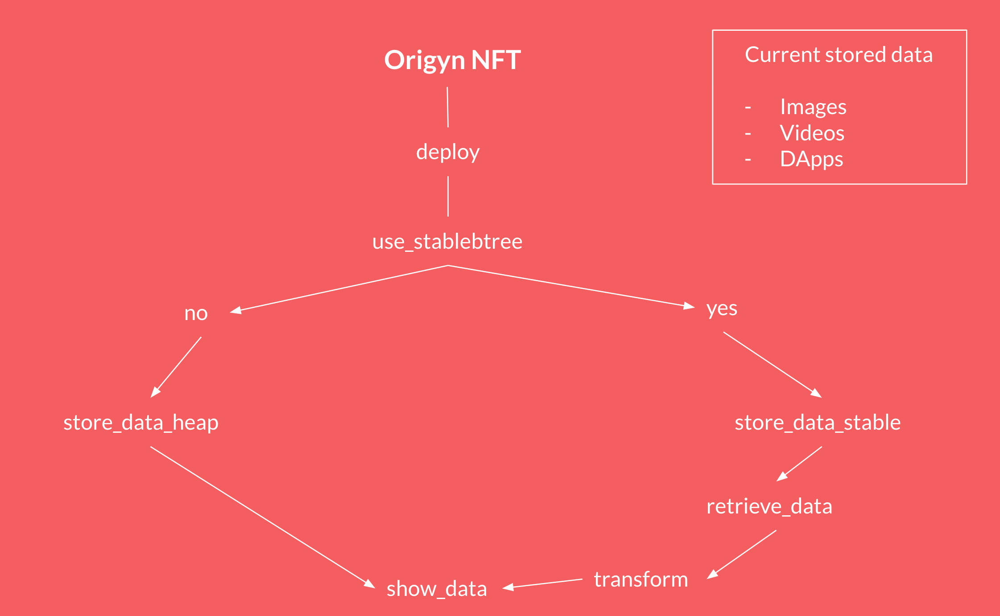

# Stable Memory in Origyn NFT

The Origyn NFT canister now has the ability to store big chunks of data in the Stable Memory.

Advantages :

- Up to 48 GiB of storage space
- Persistence across upgrades (no need to worry about pre & post scripts)
- IC plans to increase stable Memory in the future
  
Disadvantages :

- A bit slower than storing this data in the heap memory. This is due to queries + transformations  - from byte array [Nat8] to Blob. The difference is in milliseconds
  

In the Origyn NFT we store many types of data, however, the biggest chunks come from images, videos or complete web pages embeded in each NFT (think of DApps : ledger, wallet, marketplace, etc).

That is why we have opted to add this optional feature of storing these big chunks of data in the Stable Memory if the Origyn NFT user decides to. See graphic below:

For this specific example I will use our .

### Deploying Origyn NFT with Stable Memory enabled

1. Find `stable var use_stableBTree : Bool = false;` in origyn_nft_refence `main.mo` and change it to `true`. Make sure you save this change
2. Do you regular deployment.

### Deploying Origyn NFT with Stable Memory enabled in Minting Starter

1. Clone `minting_starter branch 0.1.4`
2. For this tutorial purpose I will deploy locally `brain-matters` project but you can follow these same instructions to deploy your own project locally or to the IC
3. In `deploy.sh` adjust `IC_NETWORK` and `IDENTITY_NAME` accordingly (local vs IC)
4. Once the following change is in main you don't need to the following.
   1. `cd origyn_nft`
   2. `git checkout ENG-1072-stablebtree`
5. Find `stable var use_stableBTree : Bool = false;` in origyn_nft_refence `main.mo` and change it to `true`. Make sure you save this change
6. From the root directory of minting_starter run the following to deploy your project `yes yes | bash projects/brain-matters/deploy.sh`
7. Wait for the script to finish. At this point your project should have been deployed

That is it!!!

### How to test Stable Memory

There are a few ways to test your data has been stored in the Stable Memory but first you can launch the experience pages to make sure everything is working as expected.

Here are some instructions from minting_starter : 

#### 1. Example URLs

Combine a root URL and a root-relative URL to get a full example of an absolute URL.

**Root URLs**

-   Canister ID

    -   Localhost
        -   http://rrkah-fqaaa-aaaaa-aaaaq-cai.localhost:8000
    -   Mainnet
        -   https://ap5ok-kqaaa-aaaak-acvha-cai.raw.ic0.app

-   Proxy

    -   Localhost (must have the proxy running locally first)
        -   http://localhost:3000/-/rrkah-fqaaa-aaaaa-aaaaq-cai
    -   Mainnet
        -   https://prptl.io/-/ap5ok-kqaaa-aaaak-acvha-cai

-   Proxy + Phonebook
    -   Localhost (must have the proxy running locally first)
        -   http://localhost:3000/-/bm
    -   Mainnet
        -   https://prptl.io/-/bm

**Root-Relative URLs**

-   Collection Level

    -   Standard Info URLs

        -   /collection/info
        -   /collection/ledger_info
        -   /collection/library

    -   Origyn DApp URLs
        -   /collection/-/vault
        -   /collection/-/marketplace
        -   /collection/-/library
        -   /collection/-/ledger
        -   /collection/-/data

-   NFT Level

    -   Standard Info URL

        -   /-/token-id/info
        -   /-/token-id/ledger_info
        -   /-/token-id/library

    -   Standard Asset Type URLs ("token-id" is the token ID of an NFT)

        -   /-/token-id/primary
        -   /-/token-id/preview
        -   /-/token-id/hidden
        -   /-/token-id/ex

    -   Direct Asset URLs ("token-id" is the token ID of an NFT)
        -   /-/token-id/-/primary1.png
        -   /-/token-id/-/preview1.png
        -   /-/token-id/-/mystery-bm.gif
        -   /-/token-id/-/experience1.html

#### 2. Query NFT library 

As you saw in the graph above if we are storing those big chunks of data in the Stable Memory we can query our NFT library and verify that instead of Blobs of data we only have Nat32 numbers referencing the key of that piece of data stored in Stable Memory. Here is the query :

`dfx canister call origyn_nft_reference show_nft_library_array`

#### 3. Query all entry keys for every chunk stored

`dfx canister call origyn_nft_reference show_btree_entries_keys`

#### 4. Query specific chunk in Stable Memory

`dfx canister call origyn_nft_reference get_btree_entry '(369_247_412)'`

### Deploying Origyn NFT along with a Storage Canister and Stable Memory enabled

1. Follow the same steps as `Deploying Origyn NFT` but before deploying make sure you flip `use_stableBTree` flag to `true` in the storage_canister and uncomment lines for deploying storage canister in `deploy.sh`

**To Do :**

- Find the best way to flip flag `use_stableBTree` before deployment
- We need to make sure that when flag is true allocation for those chunks do not ocurr
- Add ONLY ADMIN access to stable_b_tree queries and nft_library

